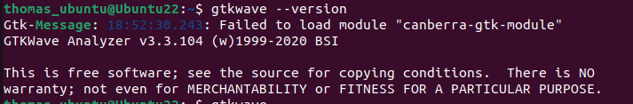
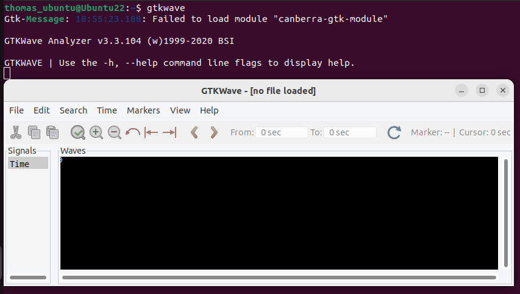

# Tool Installation

### Virtual Machine

As I am using a system with Windows OS, a virtual machine which have Ubuntu OS is made using Oracle VirtualBox.

### **Virtual Machine Configuration**
- 6 GB RAM
- 50 GB HDD
- Ubuntu 22.04.5
- 4 vCPU

## **TOOLS:**

### **1. Yosys**
Yosys is an open-source framework used to synthesis verilog codes of the designed modules into a netlist.
```bash
$ sudo apt-get update
$ git clone https://github.com/YosysHQ/yosys.git
$ cd yosys
$ sudo apt install make
$ sudo apt-get install build-essential clang bison flex \
    libreadline-dev gawk tcl-dev libffi-dev git \
    graphviz xdot pkg-config python3 libboost-system-dev \
    libboost-python-dev libboost-filesystem-dev zlib1g-dev
$ make config-gcc
# Yosys build depends on a Git submodule called abc, which hasn't been initialized yet. You need to run the following command before running make
$ git submodule update --init
$ make 
$ sudo make install
```
To start working with Yosys, run:
```
$ yosys
```
The command line interface of Yosys:


### **2. Iverilog**

Iverilog or Icarus verilog is an open-source verilog compiler, which is used during simulation of RTL design made in verilog.

```bash
$ sudo apt-get update
$ sudo apt-get install iverilog
```
Version of iverilog installed:


### **3. Gtkwave**
Gtkwave is an open-souce tool used to observe the waveforms generated during simulation of RTL modules. This is useful for checking the functionality and debugging of the designs

```bash
$ sudo apt-get update
$ sudo apt install gtkwave
```

Version of Gtkwave installed:



To access GUI of Gtkwave:
```
$ gtkwave
```


